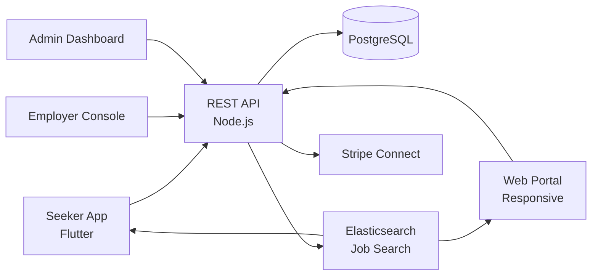

# Indeed Clone — White-Label Job Board & Recruitment Platform by Miracuves

**MXHire** is a production-ready, white-label Indeed clone: a complete job-board & recruitment platform with seeker, employer, and admin panels — delivered with **100% source code ownership** in **6 working days**.

> 💼 **See it running before you talk to anyone.** Live seeker app, employer console, and admin dashboard — demo credentials are printed on the [solution page](https://miracuves.com/indeed-clone#demo). No sales call required.

---

## 🚀 Live Demos

| Environment | URL | What you can test |
|---|---|---|
| 📱 Seeker App | [mas.mimeld.com](https://mas.mimeld.com) | Search jobs, alerts, apply, profile |
| 🌐 Web Portal | [mxhire.mimeld.com](https://mxhire.mimeld.com) | Full job-board in browser |
| 🏢 Employer Console | [Solution page → Demo](https://miracuves.com/indeed-clone#demo) | Post jobs, search candidates, ATS, analytics |
| 🛠️ Admin Dashboard | [Solution page → Demo](https://miracuves.com/indeed-clone#demo) | Jobs, employers, candidates, analytics |

Demo credentials for all environments: **[miracuves.com/indeed-clone → Demo section](https://miracuves.com/indeed-clone/#demo)**

---

## ✨ What Makes This Indeed Clone Different

Most job-board scripts stop at "list + apply." This platform ships with the features that actually run a recruiting *business*:

- **AI Resume-Match Scoring** — matches job description to candidate resumes with explainable scores — what saves recruiters hours
- **Built-In ATS Pipeline** — 
- **Salary Insights** — drag-drop applicant pipeline, interview kits, scorecards — no extra SaaS needed for hiring teams
- **Company Reviews** — helps candidates tailor cover letters per job — increases application volume
- **AI Cover-Letter Writer** — employees rate companies, attach photos, respond — what Glassdoor turned into a $1.6B business

## 📦 Core Features

**Job Seeker:** search jobs · filters · 1-tap apply · resume upload · alerts · profile · saved searches · interview scheduler

**Employer:** post jobs · search candidates · ATS pipeline · interview scheduler · reviews · analytics · job boosts

**Admin:** employer verification · category management · commission engine · analytics reports

## 🏗️ Architecture

**Stack:** Flutter mobile apps · Node.js backend · Elasticsearch for job search · PostgreSQL · Stripe Connect for payouts · Stripe, regional gateways

## 📋 What’s Included

- ✅ Full source code — backend, web, mobile apps, panels (no encryption, no license locks)
- ✅ Deployment to your servers & app store submission assistance
- ✅ Your branding — white-label rename, logo, colors, domain
- ✅ 60 days post-launch support + 12 months of free updates
- ✅ Documentation & handover

**Pricing:** from **$2,899**, transparent on the [solution page](https://miracuves.com/indeed-clone/#pricing) — no "contact us for quote" games.

## 🆚 Why Not Build From Scratch?

Custom job boards run $60k–$250k and 4–8 months. A proven white-label base gets you to market in 6 working days for a fraction of that, with your budget preserved for employer outreach and SEO of job pages.

## 📚 Resources

- 📖 [Indeed Clone — Full Solution Page](https://miracuves.com/indeed-clone) (features, pricing, demos, FAQ)
- 💰 [How Much Does a Job Board App Cost in 2026?](https://miracuves.com/indeed-clone#pricing) pricing breakdown & what's included
- 📝 [Best Indeed Clone Script in 2026](https://miracuves.com/indeed-clone/blog/) features, pricing & launch guide
- 🧠 [SEO of Job Pages: The Underrated Job Board Moat](https://miracuves.com/indeed-clone/blog/) long-tail programatic SEO
- ✅ [Miracuves Facts & Claims Ledger](https://miracuves.com/indeed-clone/facts/) every claim we make, verified

## 🏢 About Miracuves

[Miracuves Solutions](https://miracuves.com) builds white-label clone apps and custom software from Mumbai, India — 90+ ready-made solutions, live demos for every product, transparent pricing, and delivery in 6 working days. Operating since 2010.

**Talk to us:** [WhatsApp](https://wa.me/919830009649) · [Schedule a consultation](https://miracuves.com/schedule-consultation/) · [miracuves.com](https://miracuves.com)

---

### ⚠️ Note on This Repository

This repository is a product overview. The full source code is delivered to clients on purchase — see [what’s included](https://miracuves.com/indeed-clone/#included). For a hands-on evaluation, use the live demos above; credentials are public on the solution page.

*Keywords: indeed clone, indeed clone script, job board, recruitment, white label Indeed, ATS, Flutter job app, Node.js job board*

---

<!--
══════════════════════════════════════════════════
TEMPLATE VARIABLE KEY — auto-generated from Netflix-Clone pattern
══════════════════════════════════════════════════
{APP_NAME}        Indeed Clone
{MX_NAME}         MXHire
{CATEGORY}        Job Board & Recruitment Platform
{DEMO_WEB}        mxhire.mimeld.com
{PRICE}           $2,899
{SLUG}            indeed-clone
{SOLUTION_URL}    https://miracuves.com/indeed-clone/
{VERTICAL}        job_freelance

See /tmp/verticals/job_freelance.txt for the vertical config used to generate this README.
══════════════════════════════════════════════════
-->